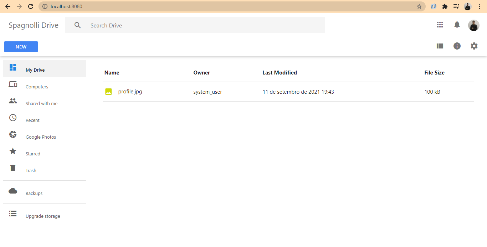

# Google Drive Clone - Semana JS Expert 5.0

Seja bem vindo(a) à quinta Semana Javascript Expert. Este é o código inicial para iniciar nossa jornada.

Marque esse projeto com uma estrela 🌟

## Preview

## Checklist Features

- Web API

  - [x] Deve listar arquivos baixados
  - [x] Deve receber stream de arquivos e salvar em disco
  - [x] Deve notificar sobre progresso de armazenamento de arquivos em disco
  - [x] Deve permitir upload de arquivos em formato image, video ou audio
  - [x] Deve atingir 100% de cobertura de código em testes

- Web App
  - [x] Deve listar arquivos baixados
  - [x] Deve permitir fazer upload de arquivos de qualquer tamanho
  - [x] Deve ter função de upload via botão
  - [x] Deve exibir progresso de upload
  - [x] Deve ter função de upload via drag and drop
